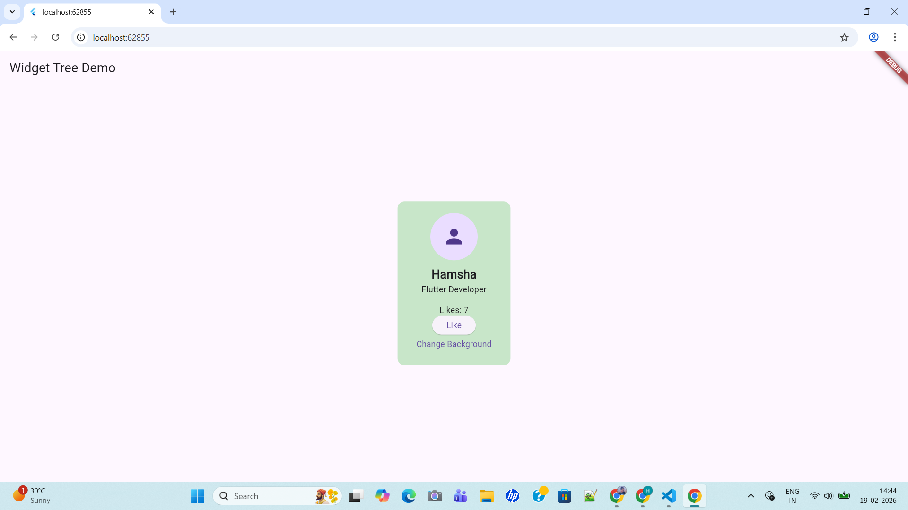

# flutter_application_1

A new Flutter project.

## Getting Started

This project is a starting point for a Flutter application.

A few resources to get you started if this is your first Flutter project:

- [Learn Flutter](https://docs.flutter.dev/get-started/learn-flutter)
- [Write your first Flutter app](https://docs.flutter.dev/get-started/codelab)
- [Flutter learning resources](https://docs.flutter.dev/reference/learning-resources)

For help getting started with Flutter development, view the
[online documentation](https://docs.flutter.dev/), which offers tutorials,
samples, guidance on mobile development, and a full API reference.

## Flutter Basics: Widget Tree & Reactive UI

StatelessWidget is for static UI, StatefulWidget updates dynamically with state changes. Flutter builds UIs using a widget tree, re-rendering only changed parts for efficiency. Dart is ideal for Flutter with object-oriented, null-safe, and async-friendly features. Demo app: Counter App updates instantly with Hot Reload. 
Screenshots show UI on Android/iOS.

## Flutter Folder Structure 

main.dart – App entry point.

screens/ – App pages (UI screens).

widgets/ – Reusable components.

models/ – Data structures.

services/ – API/Firebase logic.

This structure keeps UI, logic, and data separate, making the app modular and scalable.
Files use snake_case, classes/widgets use PascalCase, and variables use camelCase.

----------

## Widget Tree & Reactive UI Demo

This Flutter app demonstrates the widget tree structure and Flutter’s reactive UI model using a simple profile card with interactive buttons.

## Widget Tree Hierarchy
MaterialApp
 ┗ ProfileCard
    ┗ Scaffold
       ┣ AppBar
       ┗ Body
          ┗ Container
             ┗ Column
                ┣ CircleAvatar
                ┣ Text
                ┣ ElevatedButton
                ┗ TextButton

## Screenshots:

## Explanation

A widget tree is a hierarchical structure where every UI element in Flutter is a widget arranged as parent and child.

Flutter follows a reactive model — when setState() is called, only the affected widgets rebuild instead of the entire UI. This makes the app efficient and smooth.

----------

## 3.14

This Flutter demo showcases the difference between StatelessWidget and StatefulWidget.  
Stateless widgets are used for static UI elements that do not change during runtime.  
Stateful widgets manage dynamic data and update the UI using setState().  
The app demonstrates this with a profile card featuring a like counter and background toggle.

-----------

## 3.20 Handling User Input with TextFields, Buttons, and Form Widgets:

This Flutter app demonstrates widget tree structure, state management, and user input handling using Forms.
The ProfileCard screen uses setState to manage likes and background color changes dynamically.
The UserInputForm screen collects name and email input with validation using Form and TextFormField.
SnackBar feedback and Navigator.push are used to provide user interaction and screen navigation.

-----------

## 3.21 Managing Local UI State with setState and Stateful Logic

This Flutter app demonstrates Stateless and Stateful widgets with dynamic UI updates using setState().
The ProfileCard screen updates likes and background color interactively.
The app also includes form validation and navigation between screens.

----------