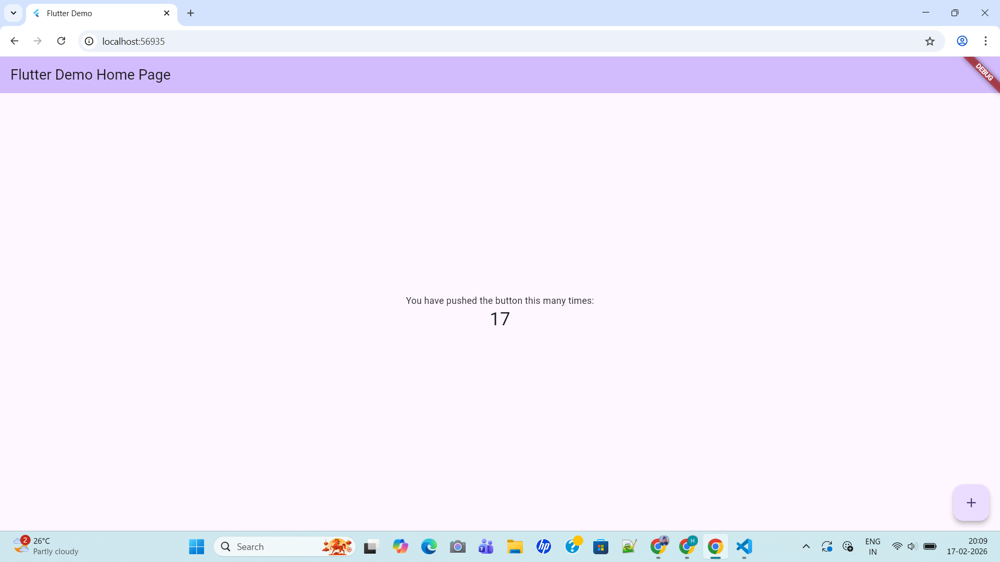
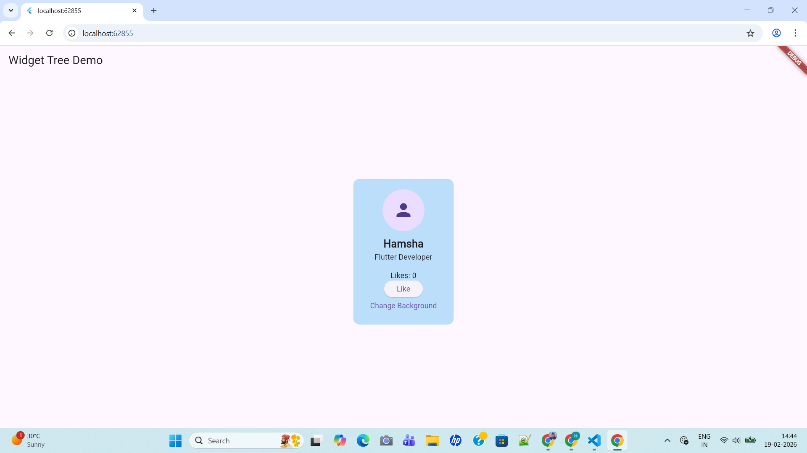
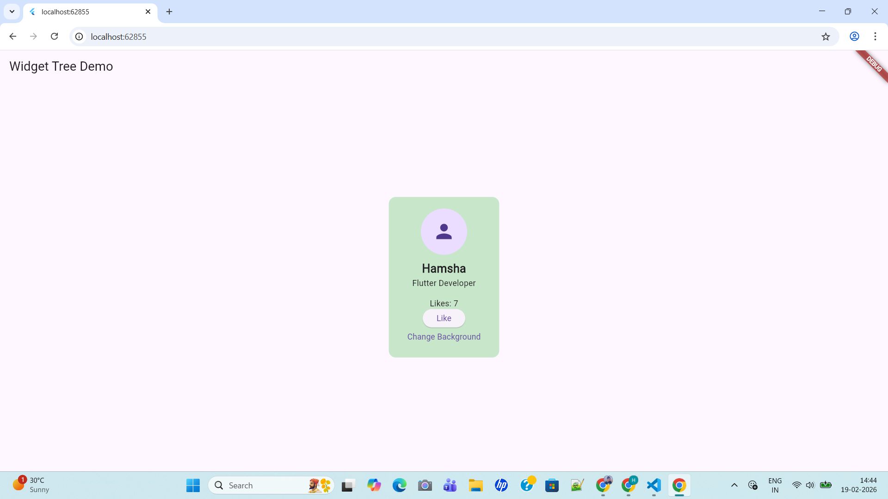
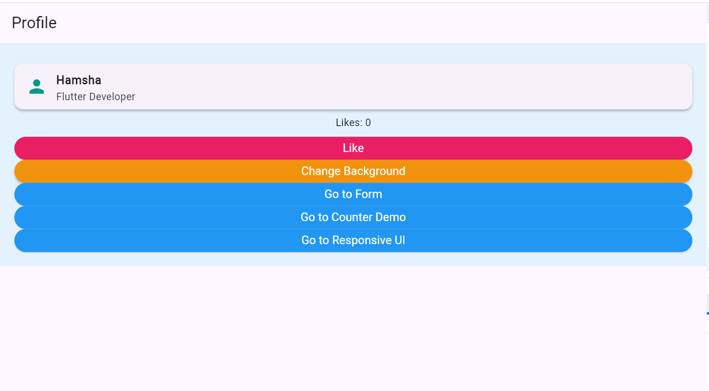
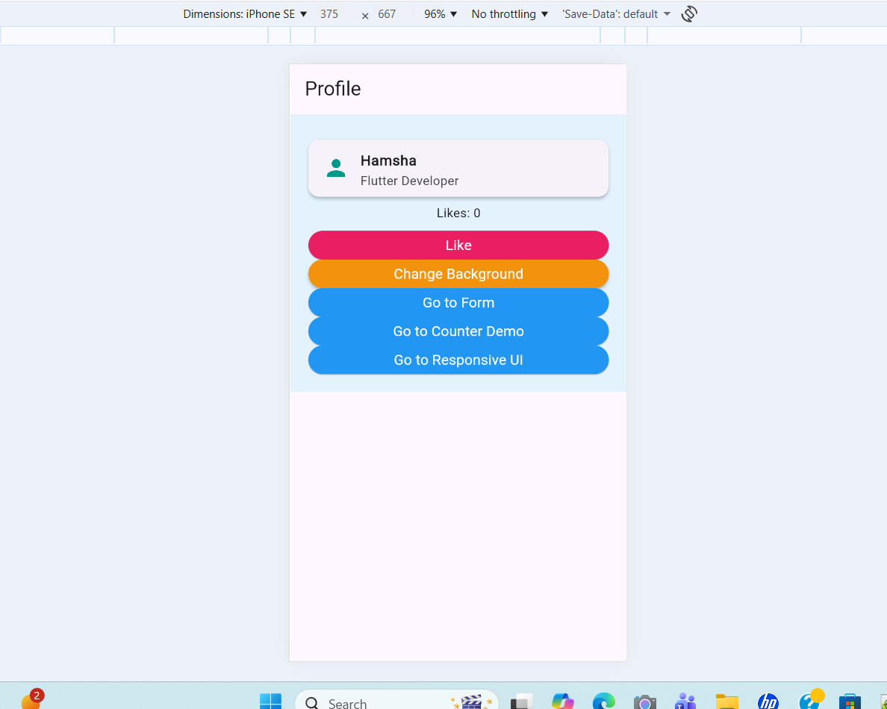

# ScoreSync — Flutter + Firebase App

A Flutter project demonstrating Firebase Authentication, Cloud Firestore real-time sync, and Firebase Storage integration.

---

## Firebase Setup Steps

1. Go to [Firebase Console](https://console.firebase.google.com/) and create a project.
2. Add your Android / iOS / Web app inside the project.
3. Download `google-services.json` (Android) or `GoogleService-Info.plist` (iOS) and place them in the correct folders.
4. Run `flutterfire configure` to auto-generate `firebase_options.dart`.
5. Add dependencies to `pubspec.yaml`:

```yaml
firebase_core: ^3.0.0
firebase_auth: ^5.0.0
cloud_firestore: ^5.0.0
```

6. Initialize Firebase in `main.dart`:

```dart
void main() async {
  WidgetsFlutterBinding.ensureInitialized();
  await Firebase.initializeApp(
    options: DefaultFirebaseOptions.currentPlatform,
  );
  runApp(MyApp());
}
```

---

## How Firestore Real-Time Sync Works

Cloud Firestore uses **persistent WebSocket connections** to push data to all connected clients the moment a document changes — no manual refresh or polling needed.

In this app:
- `FirestoreService.getTasks()` returns a `Stream<QuerySnapshot>`.
- The `StreamBuilder` widget in `TasksScreen` listens to that stream.
- When any user adds or deletes a task, **every connected device updates instantly** because the stream emits a new event.

This is the key difference from a regular REST API — Firestore is *reactive by default*.

---

## Firebase Services Used

| Service | Purpose in this app |
|---|---|
| **Firebase Auth** | Email/password sign up and login, session persistence |
| **Cloud Firestore** | Real-time task list — add and delete tasks synced live |
| **Firebase Storage** | Not used — requires Blaze (paid) plan. Auth + Firestore cover all assignment requirements. |

---

## How Firebase Solves the Syncly Problem

The case study described a to-do app where updates took minutes to appear across devices. Firebase solves this with three services working together:

- **Firebase Auth** — Secure, session-persistent login so users never get logged out unexpectedly.
- **Cloud Firestore** — Real-time listeners mean data appears instantly on all devices without any manual sync code.
- **Firebase Storage** — Scalable file hosting, so image uploads don't slow down the app or require a separate server.

Together, these eliminate the need for a custom backend entirely.

---

## Running the App

```bash
flutter pub get
flutter run -d chrome   # or -d macos
```

---


A few resources to get you started if this is your first Flutter project:

- [Learn Flutter](https://docs.flutter.dev/get-started/learn-flutter)
- [Write your first Flutter app](https://docs.flutter.dev/get-started/codelab)
- [Flutter learning resources](https://docs.flutter.dev/reference/learning-resources)

For help getting started with Flutter development, view the
[online documentation](https://docs.flutter.dev/), which offers tutorials,
samples, guidance on mobile development, and a full API reference.

## Flutter Basics: Widget Tree & Reactive UI

StatelessWidget is for static UI, StatefulWidget updates dynamically with state changes. Flutter builds UIs using a widget tree, re-rendering only changed parts for efficiency. Dart is ideal for Flutter with object-oriented, null-safe, and async-friendly features. Demo app: Counter App updates instantly with Hot Reload. 
Screenshots show UI on Android/iOS.


## Flutter Folder Structure 

main.dart – App entry point.

screens/ – App pages (UI screens).

widgets/ – Reusable components.

models/ – Data structures.

services/ – API/Firebase logic.

This structure keeps UI, logic, and data separate, making the app modular and scalable.
Files use snake_case, classes/widgets use PascalCase, and variables use camelCase.

----------

## Widget Tree & Reactive UI Demo

This Flutter app demonstrates the widget tree structure and Flutter’s reactive UI model using a simple profile card with interactive buttons.

## Widget Tree Hierarchy
MaterialApp
 ┗ ProfileCard
    ┗ Scaffold
       ┣ AppBar
       ┗ Body
          ┗ Container
             ┗ Column
                ┣ CircleAvatar
                ┣ Text
                ┣ ElevatedButton
                ┗ TextButton

## Screenshots:





## Explanation

A widget tree is a hierarchical structure where every UI element in Flutter is a widget arranged as parent and child.

Flutter follows a reactive model — when setState() is called, only the affected widgets rebuild instead of the entire UI. This makes the app efficient and smooth.

----------

## 3.14

This Flutter demo showcases the difference between StatelessWidget and StatefulWidget.  
Stateless widgets are used for static UI elements that do not change during runtime.  
Stateful widgets manage dynamic data and update the UI using setState().  
The app demonstrates this with a profile card featuring a like counter and background toggle.

-----------

## 3.20 Handling User Input with TextFields, Buttons, and Form Widgets:

This Flutter app demonstrates widget tree structure, state management, and user input handling using Forms.
The ProfileCard screen uses setState to manage likes and background color changes dynamically.
The UserInputForm screen collects name and email input with validation using Form and TextFormField.
SnackBar feedback and Navigator.push are used to provide user interaction and screen navigation.

-----------

## 3.21 Managing Local UI State with setState and Stateful Logic

This Flutter app demonstrates Stateless and Stateful widgets with dynamic UI updates using setState().
The ProfileCard screen updates likes and background color interactively.
The app also includes form validation and navigation between screens.

----------

## 3.22 Creating Reusable Custom Widgets for Modular UI Design

This project demonstrates reusable custom widgets in Flutter to build a modular and scalable UI.
A `CustomButton` and `InfoCard` widget were created and reused across multiple screens to reduce code duplication.
This approach improves maintainability, consistency, and development speed in larger applications.

----------

## 3.23 Using MediaQuery and LayoutBuilder for Responsive Design

1. We used **MediaQuery** to get the device screen width and height.
2. We used **LayoutBuilder** to detect screen size using `constraints.maxWidth`.
3. We changed the grid layout, padding, and font size for mobile and tablet screens.
4. This made the app responsive and adaptable to different screen sizes.

   

----------

## 3.24 Managing Images, Icons, and Local Assets in Flutter Projects

• Created an assets folder and organized images properly inside the project.
• Registered assets in pubspec.yaml and used Image.asset() to display local images.
• Implemented Material and Cupertino icons to enhance the UI design.

.png>)   .png>)

----------
